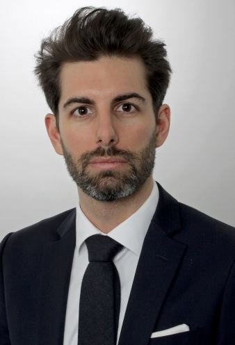

 
 
 
 
## About Us

***

[comment]: 

**klondik.io** emerged from the need expressed by Swiss NGOs from anti-fraud training backed by a strong academic background and provided by organizations with a spotless reputation. Jeremy Isnard and Olivier Beaudet-Labrecque kickstarted their first project in 2017 in association with the "Institut de Lutte contre la Criminalité Economique" (ILCE) based in Neuchâtel, with which they nurture tight ties and collaborate on a regular basis.

**Jeremy Isnard** is a Certified Fraud Examiner and a MAS ECI graduate. Coming from a strong financial analyst background and a seasoned professional, he brings solid operational analysis along with  data analysis skills gained from his experience as a Research Collaborator in Statistics.

**Olivier Beaudet-Labrecque** is a Criminologist and a MAS ECI graduate. As a Scientific Officer at the ILCE, he coordinates our relationships with our network of experts and brings a solid academic background and crucial training methods.
