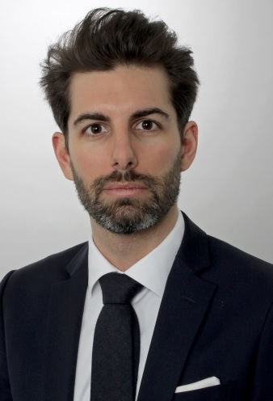

 
 
 
 
## About Us

***

Jeremy F. Isnard, CFE  founded klondik.io in 2016.

Growing professionally, his strong financial analyst background and data analysis skills were the right mix to
become a skilled economic crime investigator, and quickly moved to establish his own consulting company.

As a student of the MAS ECI he wrote his master thesis about what the Paris attacks taught us about the FATF standards on Terrorism Finance ; as a statistician he co-authored a research paper published in a top-tier management journal.

klondik.io nurtures tight ties and collaborate on a regular basis with the Institut de Lutte contre la Criminalité Economique (ILCE) in Neuchâtel.  

2017
:   Certified Fraud Examiner (CFE)
:   Certificate in Terrorism Studies \| University of St Andrews

2016
:   Master of Advanced Studies in Economic Crime Investigation \| ILCE
:   Certificate in Statistical Analysis and R Programming \| University of Washington

2014
:  Chartered Financial Analyst (CFA) Level 2 Pass

2009
:  MSc. in Finance \| Reims Management School
